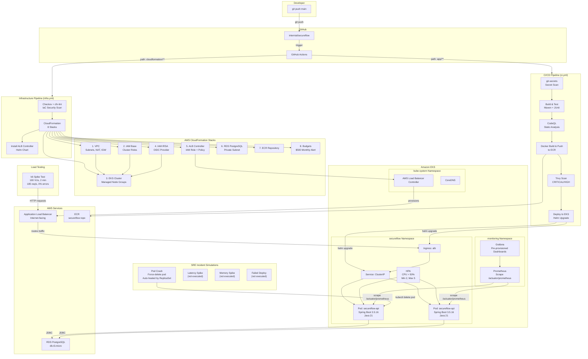

# SecureFlow Architecture

```mermaid
graph TB
    subgraph Developer["Developer"]
        DEV["git push main"]
    end

    subgraph GitHub["GitHub"]
        REPO["internial/secureflow"]
        ACTIONS["GitHub Actions"]
    end

    subgraph CI_CD["CI/CD Pipeline (ci.yml)"]
        SECRETS["git-secrets<br/>Secret Scan"]
        BUILD["Build & Test<br/>Maven + JUnit"]
        CODEQL["CodeQL<br/>Static Analysis"]
        DOCKER["Docker Build & Push<br/>to ECR"]
        TRIVY["Trivy Scan<br/>CRITICAL/HIGH"]
        DEPLOY["Deploy to EKS<br/>Helm Upgrade"]
        SECRETS --> BUILD --> CODEQL --> DOCKER --> TRIVY --> DEPLOY
    end

    subgraph INFRA["Infrastructure Pipeline (infra.yml)"]
        CHECKOV["Checkov + cfn-lint<br/>IaC Security Scan"]
        CFN_STACKS["CloudFormation<br/>8 Stacks"]
        ALB_HELM["Install ALB Controller<br/>Helm Chart"]
        CHECKOV --> CFN_STACKS --> ALB_HELM
    end

    subgraph CloudFormation["AWS CloudFormation Stacks"]
        VPC["1. VPC<br/>Subnets, NAT, IGW"]
        IAM_BASE["2. IAM Base<br/>Cluster Roles"]
        EKS["3. EKS Cluster<br/>Managed Node Groups"]
        IRSA["4. IAM IRSA<br/>OIDC Provider"]
        ALB_IAM["5. ALB Controller<br/>IAM Role + Policy"]
        RDS["6. RDS PostgreSQL<br/>Private Subnet"]
        ECR["7. ECR Repository"]
        BUDGETS["8. Budgets<br/>$500 Monthly Alert"]
    end

    subgraph AWS_EKS["Amazon EKS"]
        subgraph K8S_NS["secureflow Namespace"]
            POD1["Pod: secureflow-api<br/>Spring Boot 3.5.16<br/>Java 21"]
            POD2["Pod: secureflow-api<br/>Spring Boot 3.5.16<br/>Java 21"]
            HPA["HPA<br/>CPU > 50%<br/>Min 2, Max 5"]
            INGRESS["Ingress: alb"]
            SVC["Service: ClusterIP"]
        end
        subgraph K8S_SYSTEM["kube-system Namespace"]
            ALB_CTRL["AWS Load Balancer Controller"]
            COREDNS["CoreDNS"]
        end
        subgraph MONITORING["monitoring Namespace"]
            PROM["Prometheus<br/>Scrape /actuator/prometheus"]
            GRAFANA["Grafana<br/>Pre-provisioned Dashboards"]
        end
    end

    subgraph AWS_SVC["AWS Services"]
        ALB["Application Load Balancer<br/>Internet-facing"]
        RDS_INSTANCE["RDS PostgreSQL<br/>db.t3.micro"]
        ECR_REPO["ECR<br/>secureflow repo"]
    end

    subgraph TESTING["Load Testing"]
        K6["k6 Spike Test<br/>100 VUs, 2 min<br/>185 req/s, 0% errors"]
    end

    subgraph SRE["SRE Incident Simulations"]
        CRASH["Pod Crash<br/>Force-delete pod<br/>Auto-healed by ReplicaSet"]
        LATENCY["Latency Spike<br/>(not executed)"]
        MEMORY["Memory Spike<br/>(not executed)"]
        FAILED_DEPLOY["Failed Deploy<br/>(not executed)"]
    end

    DEV -->|git push| REPO
    REPO -->|trigger| ACTIONS
    ACTIONS -->|path: app/**| CI_CD
    ACTIONS -->|path: cloudformation/**| INFRA

    CFN_STACKS --> VPC
    CFN_STACKS --> IAM_BASE
    CFN_STACKS --> EKS
    CFN_STACKS --> IRSA
    CFN_STACKS --> ALB_IAM
    CFN_STACKS --> RDS
    CFN_STACKS --> ECR
    CFN_STACKS --> BUDGETS

    VPC --> EKS
    IAM_BASE --> EKS
    IRSA --> EKS
    ALB_IAM --> ALB_CTRL

    DOCKER --> ECR_REPO
    DEPLOY -->|helm upgrade| SVC
    DEPLOY -->|helm upgrade| INGRESS

    ALB_CTRL -->|provisions| ALB
    ALB -->|routes traffic| INGRESS
    INGRESS --> SVC
    SVC --> POD1
    SVC --> POD2
    HPA --> POD1
    HPA --> POD2

    POD1 -->|JDBC| RDS_INSTANCE
    POD2 -->|JDBC| RDS_INSTANCE

    PROM -->|scrape /actuator/prometheus| POD1
    PROM -->|scrape /actuator/prometheus| POD2
    GRAFANA --> PROM

    K6 -->|HTTP requests| ALB
    CRASH -->|kubectl delete pod| POD1
```
