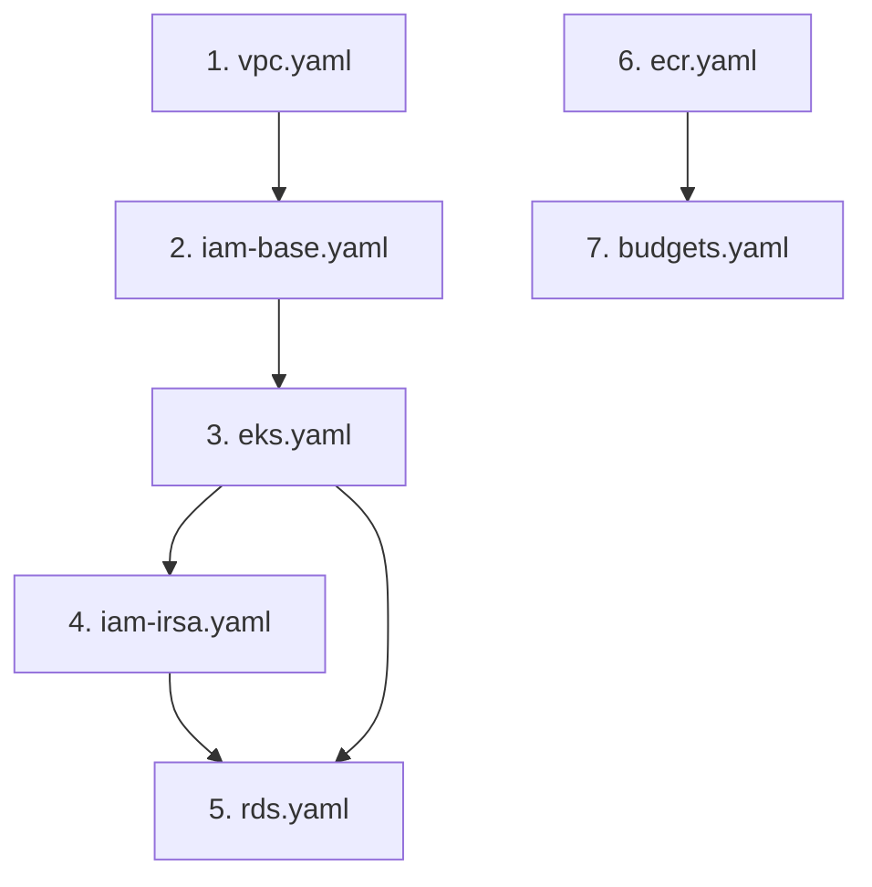

# AWS EKS & RDS Production Deployment Playbook

This document details the production staging architecture and the exact sequence of deployment and teardown steps for AWS.

## Architecture Highlights
* **Network Isolation**: The RDS PostgreSQL instance is deployed in isolated private subnets, allowing connections exclusively from the EKS nodes security group on port 5432.
* **Auto-Scaling Node Groups**: Managed t3.medium EKS nodes scale dynamically from 1 to 3 depending on HPA triggers.
* **AWS ALB Integration**: Traffic enters via an internet-facing Application Load Balancer routed directly to pod IPs (`target-type: ip`).
* **Cost Controls**: A safety net budget is established in `budgets.yaml` triggers SNS and email warnings at $5, $15, $30, and $50.

---

## Part 1: CloudFormation Stack Deployment Order

Deploys stacks in a strict chronological sequence to resolve infrastructure and OIDC dependencies.



### Step 1: Deploy Network (`vpc.yaml`)
Builds VPC, subnets, route tables, and NAT Gateway.
```bash
aws cloudformation create-stack --stack-name secureflow-vpc \
  --template-body file://cloudformation/vpc.yaml
```

### Step 2: Deploy Identity Access Base (`iam-base.yaml`)
Provisions foundational IAM Execution Roles for the cluster and nodes.
```bash
aws cloudformation create-stack --stack-name secureflow-iam-base \
  --template-body file://cloudformation/iam-base.yaml \
  --capabilities CAPABILITY_NAMED_IAM
```

### Step 3: Deploy EKS Cluster & Node Group (`eks.yaml`)
Provisions control planes and EC2 nodes inside private subnets.
```bash
aws cloudformation create-stack --stack-name secureflow-eks \
  --template-body file://cloudformation/eks.yaml
```

### Step 4: Deploy Pod Web Identity IAM (`iam-irsa.yaml`)
Registers trust providers mapping EKS pods to secure IAM roles.
*Retrieve the `OIDCIssuerURL` output from EKS Stack and strip the `https://` prefix to supply as the `OidcProvider` parameter.*
```bash
aws cloudformation create-stack --stack-name secureflow-iam-irsa \
  --template-body file://cloudformation/iam-irsa.yaml \
  --parameters ParameterKey=OidcProvider,ParameterValue=oidc.eks.us-east-1.amazonaws.com/id/EXAMPLED539D4633E53DE1B716D3041E \
  --capabilities CAPABILITY_NAMED_IAM
```

### Step 5: Deploy PostgreSQL RDS Database (`rds.yaml`)
Sets up private PostgreSQL database instance allowing connections from the EKS stack security group.
```bash
aws cloudformation create-stack --stack-name secureflow-rds \
  --template-body file://cloudformation/rds.yaml
```

### Step 6: Deploy Container Registry (`ecr.yaml`)
Provisions ECR repository with automated image vulnerability scans.
```bash
aws cloudformation create-stack --stack-name secureflow-ecr \
  --template-body file://cloudformation/ecr.yaml
```

### Step 7: Deploy Cost Budgets (`budgets.yaml`)
Sets up budget alerts to prevent runaway cloud charges.
```bash
aws cloudformation create-stack --stack-name secureflow-budgets \
  --template-body file://cloudformation/budgets.yaml \
  --parameters ParameterKey=NotificationEmail,ParameterValue=your-email@example.com
```

---

## Part 2: Register & Build the Docker Image
Retrieve ECR login credentials and push the production release of the Spring Boot CRUD container:

1. Authenticate Docker with ECR:
   ```bash
   aws ecr get-login-password --region <your-region> | docker login --username AWS --password-stdin <aws-account-id>.dkr.ecr.<your-region>.amazonaws.com
   ```
2. Build and tag the image:
   ```bash
   docker build -t secureflow ./app
   docker tag secureflow:latest <aws-account-id>.dkr.ecr.<your-region>.amazonaws.com/secureflow:latest
   ```
3. Push to ECR:
   ```bash
   docker push <aws-account-id>.dkr.ecr.<your-region>.amazonaws.com/secureflow:latest
   ```

---

## Part 3: Deploy via Helm
1. Update `helm/secureflow/values-eks.yaml` with production parameters:
   * **`db.url`**: Replace with RDS Endpoint address (e.g. `jdbc:postgresql://secureflow-rds.c123456789.us-east-1.rds.amazonaws.com:5432/secureflow`).
   * **`ingress.host`**: Replace with ALB DNS hostname.
   * **`image.repository`**: Replace with your ECR Repository URI.

2. Configure kubectl for EKS:
   ```bash
   aws eks update-kubeconfig --region <your-region> --name secureflow-cluster
   ```

3. Deploy via Helm:
   ```bash
   helm upgrade --install secureflow ./helm/secureflow \
     --namespace secureflow \
     --create-namespace \
     --values helm/secureflow/values-eks.yaml
   ```

4. Verify deployment:
   ```bash
   kubectl get pods -n secureflow
   kubectl get svc -n secureflow
   ```

---

## Part 4: Cost Optimization & Teardown Order
To avoid accumulating ongoing charges after testing or demonstration:

1. **Delete the Helm release** (prunes ingress ALBs, services, and workloads):
   ```bash
   helm uninstall secureflow -n secureflow
   ```
2. **Wait for ALB resources to be deleted** on AWS (takes ~5 minutes).
3. **Delete CloudFormation stacks in reverse order**:
   ```bash
   aws cloudformation delete-stack --stack-name secureflow-budgets
   aws cloudformation delete-stack --stack-name secureflow-ecr
   aws cloudformation delete-stack --stack-name secureflow-rds
   aws cloudformation delete-stack --stack-name secureflow-iam-irsa
   aws cloudformation delete-stack --stack-name secureflow-eks
   aws cloudformation delete-stack --stack-name secureflow-iam-base
   aws cloudformation delete-stack --stack-name secureflow-vpc
   ```
